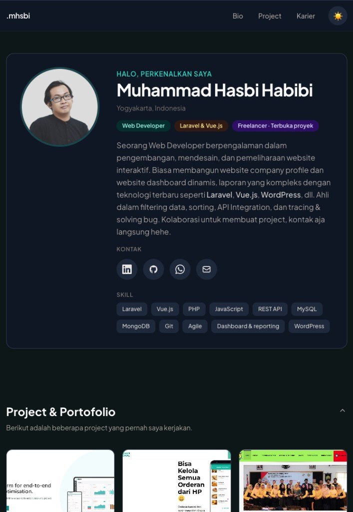

# mhsbi

Portfolio one page (HTML + Tailwind CDN + `serve` untuk lokal).

## Struktur halaman

Situs ini satu file `index.html` dengan alur dari atas ke bawah:

| Bagian | `id` / penanda | Isi ringkas |
|--------|----------------|-------------|
| **Header** (tetap di atas) | tautan ke `#bio` | Teks **.mhsbi**, menu **Bio** · **Project** · **Karier**, tombol mode terang/gelap. |
| **Bio** | `#bio` | Foto profil, salam, nama, lokasi, tag peran (Web Developer, Laravel & Vue, Freelancer), deskripsi singkat. |
| **Kontak** | `#kontak` (di dalam blok Bio) | Ikon bulat: LinkedIn, GitHub, WhatsApp (`wa.me`), email (`mailto`). |
| **Skill** | (di dalam blok Bio) | Pill teknologi (Laravel, Vue.js, PHP, dll.). |
| **Project & Portofolio** | `#projects` | Judul bisa dilipat; grid kartu proyek (screenshot, teks, tag, tautan). |
| **Pengalaman & Pendidikan** | `#experience` | Dua kolom ber-timeline; tiap kolom bisa dibuka/ditutup (`<details>`). |
| **Footer** | — | Baris copyright / nama. |

Penjelasan serupa ada sebagai komentar di awal `<body>` pada `index.html` agar mudah dipetakan saat menyunting kode.

## Prasyarat

- **Git** — untuk meng-clone repositori.
- **Node.js** versi **18 atau lebih baru** (lihat juga `.nvmrc` jika memakai [nvm](https://github.com/nvm-sh/nvm)).
- **npm** (biasanya ikut dengan Node).

## Clone project

Di terminal:

```bash
git clone <URL_REPOSITORI_ANDA> mhsbi
cd mhsbi
```

Ganti `<URL_REPOSITORI_ANDA>` dengan URL HTTPS atau SSH milikmu.

## Install dependensi

```bash
npm install
```

Ini memasang paket `serve` untuk server statis lokal (lihat `package.json`).

Preview tampilan portfolio (mode gelap contoh):



## Menjalankan di lokal (development)

Menyajikan folder proyek dari **root** (agar path seperti `assets/pp.jpeg` tetap benar):

```bash
npm run dev
```

Buka di browser: **http://localhost:5173**

Perintah `npm start` sama dengan `npm run dev`.

## Build untuk production

Build menyalin `index.html` dan folder `assets/` ke folder **`public/`** di root project:

```bash
npm run build
```

Hasil siap deploy ada di **`public/`** (bukan file di root).

### Cek hasil build secara lokal

```bash
npm run preview
```

Lalu buka **http://localhost:4173** — ini melayani isi `public/`, mirip environment production statis.

---

## Deploy ke server production

Ini situs **statis** (HTML, gambar lokal di `assets/`, plus gambar proyek dari URL CDN). Tidak perlu runtime Node di server production kecuali kamu sengaja memakai Node sebagai static file server.

### Yang di-upload ke server

Setelah `npm run build`, **unggah seluruh isi folder `public/`** (di repo kamu) ke **document root** web server — misalnya isi `public/` ke `public_html` di shared hosting (nama folder di server bisa beda; yang penting isi file-nya).

Struktur di server seharusnya mirip:

```text
/ (document root)
├── index.html
└── assets/
    ├── pp.jpeg
    └── …
```

### Opsi umum

1. **VPS + Nginx / Apache**  
   - Upload isi folder **`public/`** hasil build (misalnya dengan `rsync`, `scp`, SFTP, atau panel hosting).  
   - Arahkan `root` (Nginx) atau `DocumentRoot` (Apache) ke folder tersebut.

2. **Shared hosting (cPanel, dll.)**  
   - Pakai File Manager atau FTP: salin **isi** `public/` ke `public_html` (atau setara).

3. **Platform static hosting** (Netlify, Vercel, Cloudflare Pages, GitHub Pages, dll.)  
   - Set **publish directory** ke **`public`**.  
   - Build command: `npm run build` (jika platform menjalankan build di CI).

### Catatan path (subfolder)

Jika situs tidak di akar domain (misalnya `https://domain.com/portfolio/`), path relatif ke `assets/` bisa perlu disesuaikan (atau pakai `<base href="...">`). Untuk deploy di **root domain** atau subdomain khusus (`https://portfolio.domain.com/`), konfigurasi standar di atas sudah cocok.

### Node di production (opsional)

Kalau tetap ingin melayankan dengan `serve` di VPS:

```bash
npm ci --omit=dev   # atau npm install --omit=dev setelah build di mesin build
npx serve public -l 3000
```

Lebih umum untuk production tetap memakai **Nginx/Apache** atau CDN di depannya.

## Ringkasan perintah

| Perintah        | Fungsi                                      |
|----------------|----------------------------------------------|
| `npm install`  | Install dependency                            |
| `npm run dev`  | Lokal dari root project (port 5173)         |
| `npm run build`| Generate folder `public/`                   |
| `npm run preview` | Tes statis dari `public/` (port 4173)    |
